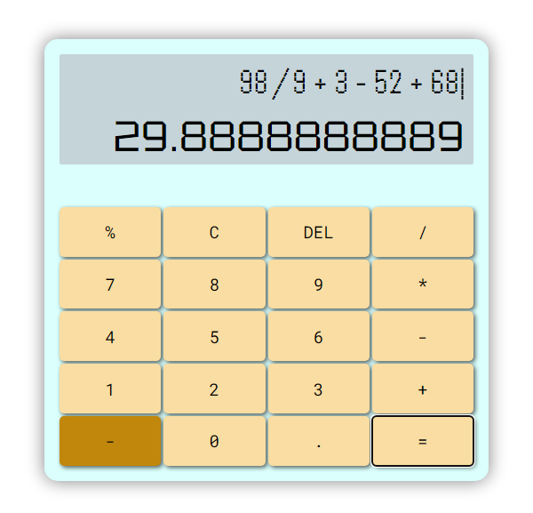

# Simple Calculator

Simple calculator, nothing new around here. Just a little programming logic exercise that included:

* Module separation
* Event listeners
* BEM Methodology
* Conversion from number to string and vice versa
* Sass implementation
* Use via mouse, keyboard input not yet developed

## Obstacles encountered and resolved

* Some functions don't work well apart from index.js.
    * The event of the keyNum and the KeyOp and their functions should have gone in the same module, (apparently the displayNum, used for calculations, was duplicated, creating two variables of the same name, at least that's how it behaved- I didn't know how else way to solve it yet).
* numbers with too many decimal places escaped from the screen. The limitDecimals() is created

## App Screenshot and Requirements

### Prerequirements

* **Sass**:

    * In this project the Sass preprocessor was used. Its use and installation is recommended. [Here its official page with the documentation](https://sass-lang.com/)

## Bye!!

**Being August 2023**, I am missing a single functionality, that of the "%" key. If you have any suggestions and implement an idea before I develop the solution, you are more than welcome to test and improve this simple app by cloning or forking it.
